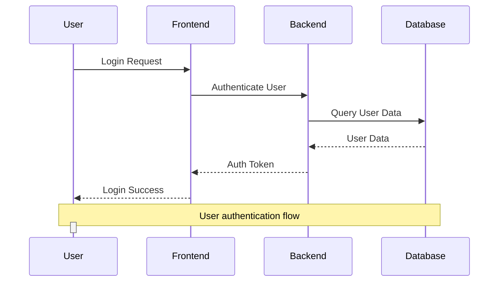

# ReactFlow Samples Documentation

This project demonstrates various ReactFlow implementations including a Mermaid sequence diagram parser that converts Mermaid syntax to ReactFlow visualizations.

## Project Overview

This React application showcases three different ReactFlow implementations:

1. **Overview Flow** - Basic ReactFlow features and interactions
2. **Sequence Diagram** - Custom sequence diagram visualization
3. **Mermaid Parser** - Converts Mermaid sequence diagram syntax to ReactFlow

## Dependencies

- `@xyflow/react` v12.8.4 - Main ReactFlow library
- `react` v19.1.1 - React framework
- `typescript` v4.9.5 - TypeScript support

## Sample Implementations

### 1. Overview Flow (`OverviewFlow.tsx`)

A comprehensive demonstration of ReactFlow's core features:

**Key Features:**
- Multiple node types (input, default, output)
- Custom node styling
- Various edge types (straight, smoothstep, step)
- Interactive features (drag, click, selection)
- Event handlers for all user interactions
- Snap to grid functionality
- MiniMap and Controls components

**Node Types:**
- `input` - Entry point nodes (blue styling)
- `default` - Standard nodes (dark styling)
- `output` - Terminal nodes (pink styling, non-deletable)

**Edge Types:**
- `straight` - Direct line connections
- `smoothstep` - Curved connections with smooth corners
- `step` - Angular step connections

**Event Handlers:**
- Node interactions: click, double-click, drag start/stop
- Edge interactions: context menu, mouse enter/leave, double-click
- Pane interactions: click, scroll, context menu, mouse move
- Selection management: drag, context menu, change events
- Viewport management: zoom/move start/end

### 2. Sequence Diagram (`SequenceDiagram.tsx`)

A custom implementation of UML sequence diagrams using ReactFlow:

**Custom Node Components:**
- `ActorNode` - Represents system actors (User, Frontend, Backend, Database)
- `MessageNode` - Represents messages between actors
- `LifelineNode` - Vertical lines showing actor lifelines

**Visual Design:**
- Actors: Blue rounded rectangles with bold text
- Messages: Green for requests, purple for responses with directional arrows
- Lifelines: Vertical gray lines with circular heads
- Request messages: Solid green lines with right arrows (→)
- Response messages: Dashed purple lines with left arrows (←)

**Layout:**
- Actors positioned horizontally at the top
- Lifelines extending vertically below each actor
- Messages positioned between lifelines with proper spacing
- Automatic spacing (60px between messages)

### 3. Mermaid Parser (`MermaidSequenceDiagram.tsx`)

A sophisticated Mermaid sequence diagram parser that converts Mermaid syntax to ReactFlow visualizations:

## Mermaid Parser Implementation

### Parser Architecture

The Mermaid parser consists of two main components:

1. **`parseMermaidSequence()`** - Parses Mermaid syntax
2. **`convertToReactFlow()`** - Converts parsed data to ReactFlow nodes/edges

### Supported Mermaid Syntax



### Parser Features

**Actor Definitions:**
- `participant A as Actor` - Defines actors with optional aliases
- Automatically extracts actor names and creates corresponding nodes

**Message Types:**
- `A->>B: Message` - Request messages (solid green lines)
- `A-->>B: Response` - Response messages (dashed purple lines)
- `Note over A,B: Text` - Notes spanning multiple actors (orange styling)
- `activate A` / `deactivate A` - Activation boxes (teal styling)

**Parsing Logic:**
```typescript
// Actor extraction
if (line.includes('participant')) {
  const match = line.match(/participant\s+(\w+)/);
  if (match) actors.add(match[1]);
}

// Message parsing with different arrow types
if (line.includes('->>') || line.includes('->') || line.includes('-->>') || line.includes('-->')) {
  const isResponse = line.includes('-->>') || line.includes('-->');
  const match = line.match(/(\w+)\s*(?:->>|-->>)\s*(\w+)\s*:\s*(.+)/);
  // Process message...
}
```

### Conversion to ReactFlow

**Node Generation:**
1. **Actor Nodes** - Created for each participant with horizontal spacing (200px apart)
2. **Lifeline Nodes** - Vertical lines below each actor (500px height)
3. **Message Nodes** - Positioned between actors with vertical spacing (60px apart)

**Edge Generation:**
- **Request Edges** - Solid green lines with `strokeDasharray: 'none'`
- **Response Edges** - Dashed purple lines with `strokeDasharray: '5,5'`
- **Note Edges** - Orange dashed lines spanning multiple actors
- **Handle Connections** - Proper source/target handle connections for ReactFlow

**Layout Algorithm:**
```typescript
// Actor positioning
actors.forEach((actor, index) => {
  nodes.push({
    id: actor,
    type: 'actor',
    data: { label: actor },
    position: { x: 50 + index * 200, y: 50 },
  });
});

// Message positioning
messages.forEach((msg, index) => {
  const yPosition = 150 + index * 60;
  // Position between source and target actors
  const xPosition = Math.min(150 + fromIndex * 200, 150 + toIndex * 200);
});
```

### Interactive Features

**Real-time Parsing:**
- Live textarea input updates the diagram instantly
- Error handling for invalid Mermaid syntax
- Console logging for debugging parsing steps

**ReactFlow Integration:**
- Full ReactFlow controls (zoom, pan, minimap)
- Node and edge manipulation
- Connection mode set to `Strict`
- Automatic fit-to-view on updates

**UI Components:**
- Split-panel layout (300px input, remaining space for diagram)
- Syntax help panel with supported commands
- Node/edge count display
- Monospace font for code input

### Error Handling

The parser includes comprehensive error handling:
- Invalid Mermaid format detection
- Missing actor references
- Malformed message syntax
- Graceful fallback to empty diagram on errors

## Usage

### Installation

First, install the dependencies:

```bash
npm install
```

### Running the Application

```bash
npm start
```

Navigate to `http://localhost:3000` and use the top navigation to switch between:
- **Overview Flow** - Basic ReactFlow demo
- **Sequence Diagram** - Static sequence diagram
- **Mermaid Parser** - Interactive Mermaid parser

### Mermaid Parser Usage

1. Select "Mermaid Parser" from the navigation
2. Edit the Mermaid syntax in the left panel
3. Watch the ReactFlow diagram update in real-time
4. Use ReactFlow controls to navigate and interact with the diagram

### Supported Mermaid Commands

- `sequenceDiagram` - Start of sequence diagram
- `participant A as Actor` - Define actors
- `A->>B: Message` - Request message
- `A-->>B: Response` - Response message  
- `Note over A,B: Text` - Note spanning actors
- `activate A` - Activate actor
- `deactivate A` - Deactivate actor

## Technical Implementation Details

### Custom Node Components

All custom nodes use ReactFlow's `Handle` component for proper connection points:

```typescript
<Handle
  type="target"
  position={Position.Left}
  id="left"
  style={{ background: '#666', width: 8, height: 8 }}
/>
```

### State Management

Uses ReactFlow's built-in state management:
- `useNodesState()` for node state
- `useEdgesState()` for edge state
- `useEffect()` for syncing parsed data with ReactFlow state

### Performance Considerations

- `useMemo()` for expensive parsing operations
- Efficient regex patterns for parsing
- Minimal re-renders through proper dependency arrays
- Console logging for debugging (can be removed in production)

## Extending the Parser

To add new Mermaid features:

1. **Add parsing logic** in `parseMermaidSequence()`
2. **Update message types** in the switch statement
3. **Add node/edge generation** in `convertToReactFlow()`
4. **Update UI help text** with new syntax

Example for adding loops:
```typescript
// In parseMermaidSequence()
if (line.includes('loop')) {
  const match = line.match(/loop\s+(.+)/);
  if (match) {
    messages.push({
      from: 'loop',
      to: 'loop',
      message: match[1],
      type: 'loop'
    });
  }
}
```

This project demonstrates the power and flexibility of ReactFlow for creating custom diagram visualizations and parsing external diagram formats.